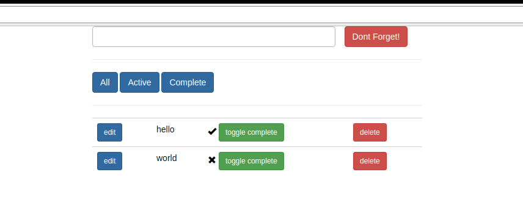
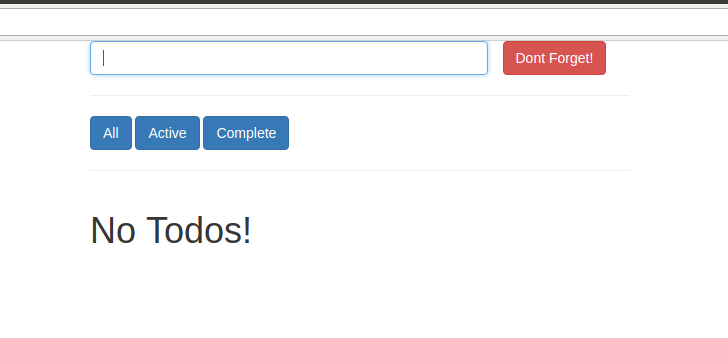
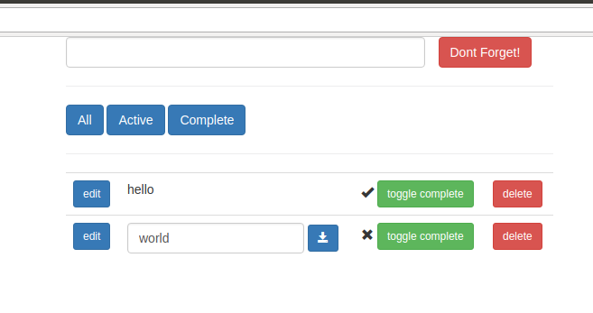

# Learning Django Templates

Welcome to the backend... not!
For this assignment, you will be providing the frontend of a todo list app.
Think [Todoist](https://en.todoist.com/) or [Wunderlist](https://www.wunderlist.com/).
However, this is a different kind of frontend than you have been writing.
No javascript is required!

For this application you will write django templates
(similar to the [Book Store][book-store] and [BaseBook][base-book] assignments).
Here are some screenshots of your goal.

## Getting started

```bash
python3 manage.py migrate
python3 manage.py runserver
```

## What do you do?

Remember, the purpose of a frontend is to sit between a backend and a user.
So you need to know two things: - How do I interact with the user? - How do I interact with the backend?

### The Backend

Interacting with the backend involves sending requests to the endpoints it exposes.
This backend exposes the following endpoints:

**todo/**

_Name:_ `app:todos`

_Method:_ GET

_Params:_

-   filter - Specifies which todos are shown. Can be `ALL`, `ACTIVE`, or `COMPLETED`.

**todo/create/**

_Name:_ `app:create`

_Method:_ POST

_Form data:_

-   title - The title of a new todo. Any string < 31 characters long.

**todo/\<id\>/toggle_editing/**

_Name:_ `app:toggle_editing`

_Method:_ POST

Toggles whether or not the post is being editted.

**todo/\<id\>/toggle_completed/**

_Name:_ `app:toggle_completed`

_Method:_ POST

Toggles whether or not the post is being editted.

**todo/\<id\>/new-title/**

_Name:_ `app:new-title`

_Method:_ POST

_Form data:_

-   title: The new title of the todo. Any string < 31 characters long.

Sets the title of the Post to the new title.

**todo/\<id\>/delete/**

_Name:_ `app:delete`

_Method:_ POST

Deletes the todo.

### The frontend

Your templates should produce a page that looks like the images included below.

When the user clicks the "Don't Forget" button, you should post entered title
to the `todo/create` endpoint.

When the user clicks one of the filter buttons, you should direct them to the
`todo/` route with the appropriate query parameters.

When the user clicks on the edit button, you should post to the appropriate
`todo/<id>/toggle_editing/` url.

etc...

#### With Todos



#### Without Todos



#### Editing a title



### More Requirements

You must split your implementation up into two templates:

-   todo.html
-   todos.html

`todos.html` will be responsible for rendering the "whole page".
`todo.html` will be responsible for rendering an individual `Todo`.
The `` tag will be important here.

You must use the following django helpers:

-   `for`
-   `if`
-   `include`
-   `url`
-   `csrf_token`

# References

-   [Django Template Syntax][django-template-syntax]
-   [Django Tag/Filter Reference][django-tag-filter]

[django-tag-filter]: https://docs.djangoproject.com/en/2.0/ref/templates/builtins/#built-in-template-tags-and-filters
[django-template-syntax]: https://docs.djangoproject.com/en/2.0/topics/templates/#the-django-template-language
[book-store]: https://github.com/BaseCampCoding/BookStore-HTMLCSS
[base-book]: https://github.com/BaseCampCoding/BaseBook-HTMLCSS
